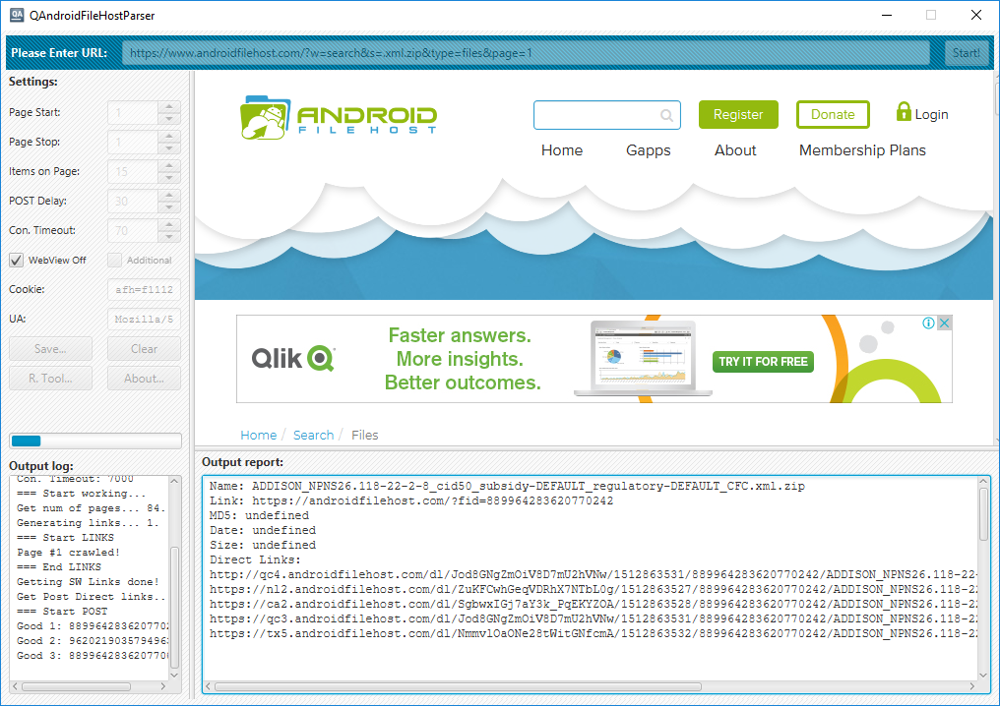
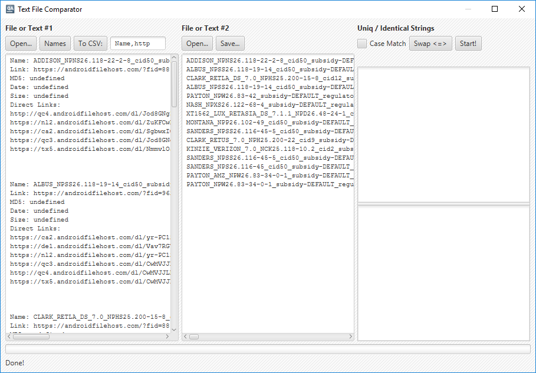

QAndroidFileHostParser
======================

Utility and tools for parsing various websites. Written with using Java and the JavaFX framework.



### File and Text Comparator Tool



This tool built-in program now (button "R. Tool ...").

## Download

You can download [7z](http://www.7-zip.org/)-bundle for MS Windows from the [releases](https://github.com/EXL/QAndroidFileHostParser/releases) section.

## Build instructions

For example, MS Windows:

* Install the latest [Java](https://www.java.com/download/);

* Clone repository into deploy directory;

```bat
cd C:\Dev\Deploy\
git clone https://github.com/EXL/QAndroidFileHostParser QAndroidFileHostParser
```

* Build the fat (with all dependencies) JavaFX-bundle into deploy directory with Gradle Build Tool;

```bat
cd C:\Dev\Deploy\QAndroidFileHostParser\
gradlew.bat jfxNative
```

* Get cooked bundle from the `build\jfx\native\` directory.

## Another branches

* Old utilities on the Qt 5 framework: [qt5_old](https://github.com/EXL/QAndroidFileHostParser/tree/qt5_old).

* Console utility Verizon Jetpack MiFi: [mifi5510](https://github.com/EXL/QAndroidFileHostParser/tree/mifi5510).
