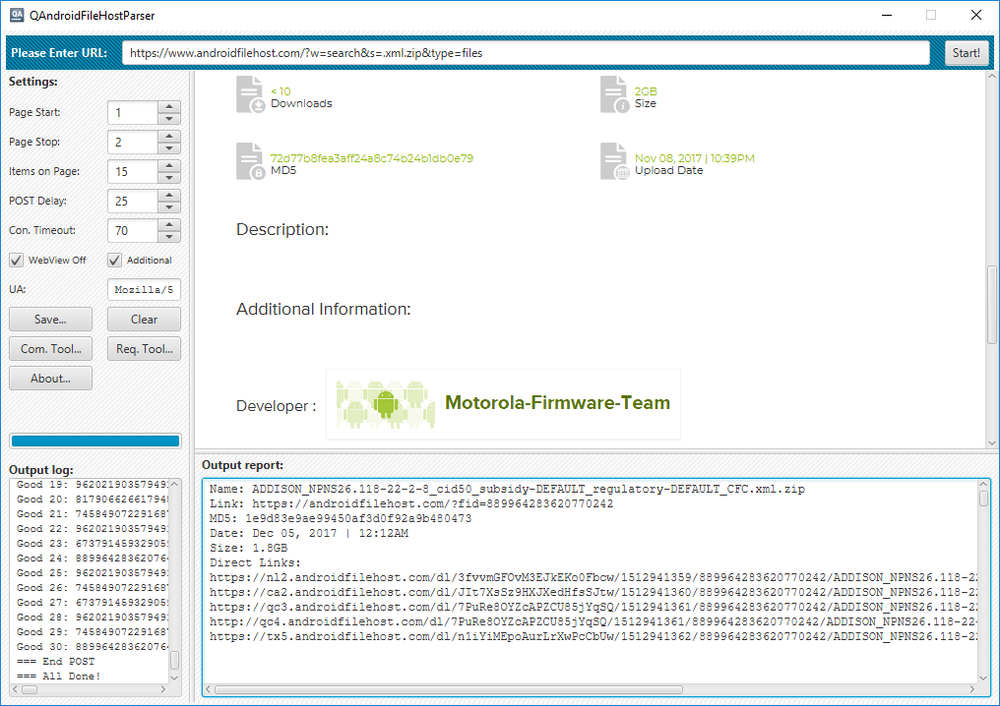
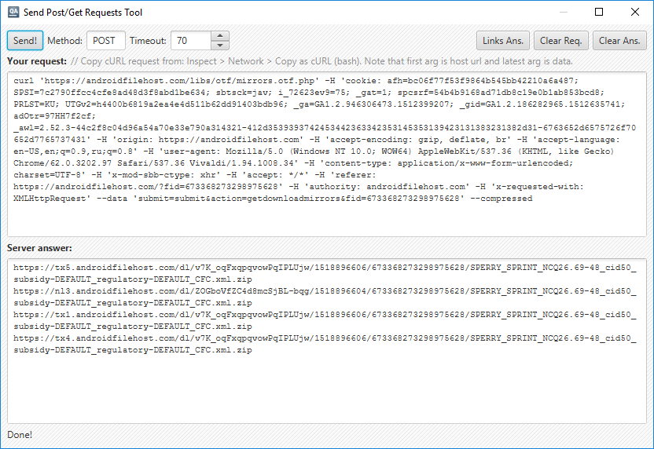
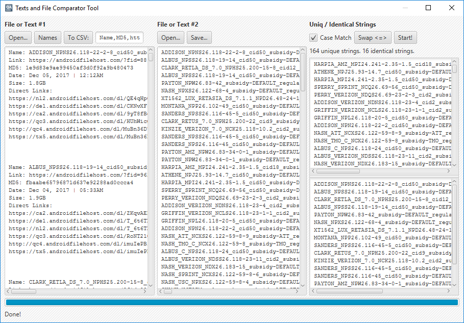

QAndroidFileHostParser
======================

Utility with tools for parsing various websites. Written with using Java and the JavaFX framework.



Built-in tools:

### Requests Tool



This tool can be used to send POST and GET requests to remote servers.

### File and Text Comparator Tool



This utility can be used to process text files, reports and generate CSV-tables.

## Download

You can download ready-to-run JavaFX-bundle packed with [7z file archiver](http://www.7-zip.org/) for MS Windows from the [releases](https://github.com/EXL/QAndroidFileHostParser/releases) section. Also you can grab small cross-platform fat (with all dependencies) JAR-package there.

## Build instructions

For example, MS Windows:

* Install the latest [JDK](http://www.oracle.com/technetwork/java/javase/downloads/index.html), tested with JDK 8;

* Clone repository into deploy directory;

```bat
cd C:\Dev\Deploy\
git clone https://github.com/EXL/QAndroidFileHostParser QAndroidFileHostParser
```

* Build the fat (with all dependencies) JAR-package into deploy catalog with Gradle Build Tool;

```bat
cd C:\Dev\Deploy\QAndroidFileHostParser\
gradlew.bat jfxJar
```

* Or build the huge JavaFX-bundle;

```bat
cd C:\Dev\Deploy\QAndroidFileHostParser\
gradlew.bat jfxNative
```

* Get cooked JAR-package from the `build\jfx\app\` or JavaFX-bundle from the `build\jfx\native\` directories.

## Another branches

* Old utilities written with using Qt 5 framework: [qt5_old](https://github.com/EXL/QAndroidFileHostParser/tree/qt5_old).

* Console utility for Verizon Jetpack MiFi: [mifi5510](https://github.com/EXL/QAndroidFileHostParser/tree/mifi5510).
